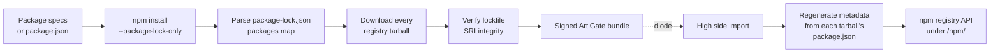

# NPM

ArtiGate mirrors npm registry packages across a data diode by delegating the entire dependency graph to the real `npm` on the low side, downloading and integrity-verifying every registry tarball, and regenerating the npm registry API on the high side from each tarball's own embedded `package.json`.

The adapter has three parts: **low-side collect** (resolve with `npm`, download tarballs, verify SRI integrity, pack a signed bundle), **high-side serve** (a regenerated npm registry API), and the **client `.npmrc`** shown in the high-side UI. See [Architecture](../architecture.md) for the diode model, and the sibling [Go modules](go.md) page for the equivalent Go flow.

## How it works



- The low side never installs anything and **never runs lifecycle scripts** — resolution uses `npm install --package-lock-only --ignore-scripts`.
- Only **registry tarballs** are mirrored. Dependencies resolved to git or file URLs are skipped and reported.
- The high side **never trusts transferred metadata**: every packument and version manifest is rebuilt from the tarball's embedded `package.json`, and `shasum`/`integrity` are recomputed from the artifact.

## Low side: inputs

`POST /admin/npm/collect` (add `?stream=1` for streamed progress). The request body has two mutually exclusive input modes:

```json
{
  "packages": ["react@^18.2", "@types/node"],
  "package_json": "",
  "package_lock": ""
}
```

| Field | Type | Meaning |
|---|---|---|
| `packages` | `[]string` | List of npm install specs. Ignored when `package_json` is set. |
| `package_json` | `string` | A project's own `package.json`, mirrored exactly as it resolves. |
| `package_lock` | `string` | Optional `package-lock.json` to pin the exact resolved graph. Requires `package_json`. |

### Mode 1 — package specs

`packages` is a list of ordinary npm install specs. Supported forms:

| Spec | Meaning |
|---|---|
| `lodash` | newest version |
| `lodash@4.17.21` | pinned version |
| `react@^18.2` | semver range |
| `@scope/pkg@latest` | scoped, newest version |
| `@types/node` | bare scoped name |

A bare name (or `name@latest`) resolves to the newest published version. In the low-side dashboard, enter one spec per line.

### Mode 2 — project files

Set `package_json` to a project's own `package.json` to mirror exactly what that project resolves. Optionally set `package_lock` to a `package-lock.json` to pin the exact resolved graph.

!!! note
    When `package_json` is set, `packages` is ignored. `package_lock` **without** `package_json` is rejected with `package_lock requires package_json`.

### Validation

- Empty specs, specs starting with `-` (would be parsed as an npm flag such as `--registry=...`), and specs containing a space or control character are rejected — this is the argument-injection guard.
- Package names must be a single path-safe element (`^[A-Za-z0-9][A-Za-z0-9._-]*$`, first char excludes `.` `_` `-`) or a two-part `@scope/pkg`, at most 214 characters.
- Versions always start with a digit (`^[0-9][0-9A-Za-z.+-]*$`), so they can never be `..`, a flag, or contain a path separator.
- The request body is read with an **8 MiB limit** (generous enough to carry an embedded `package-lock.json`). An empty body is tolerated.

## Low side: graph resolution with npm

ArtiGate materializes the project in a staging directory (`<root>/npm/staging/collect-*`) — either the provided `package.json` verbatim, or a synthetic one:

```json
{"name":"artigate-collect","version":"0.0.0","private":true}
```

It then runs `npm` with exactly these flags, appending the specs:

```bash
npm install --package-lock-only --ignore-scripts --no-audit --no-fund [--registry=<url>] <specs...>
```

| Flag | Effect |
|---|---|
| `--package-lock-only` | Resolve the full graph and write `package-lock.json`; **download and install nothing**. |
| `--ignore-scripts` | **Lifecycle scripts never run** during resolution. |
| `--no-audit` | Silence the audit call. |
| `--no-fund` | Silence funding messages. |
| `--registry=<url>` | Appended **only if** `--npm-registry` is non-empty. |

The `npm` run executes with a **15-minute timeout**, `cmd.Dir` set to the staging directory, and these environment additions on top of the inherited environment:

| Env | Value | Purpose |
|---|---|---|
| `npm_config_cache` | `<root>/npm/cache` | keep the cache out of `$HOME` |
| `npm_config_update_notifier` | `false` | suppress update checks |
| `npm_config_progress` | `false` | suppress progress bars |

The resolved graph is read back from `package-lock.json` (error `npm produced no package-lock.json` if missing) — `npm`'s output is used only for error diagnostics (last 4096 bytes on failure).

### Low-side flags

| Flag | Default | Meaning |
|---|---|---|
| `--npm` | `npm` | npm command used to resolve NPM package graphs |
| `--npm-registry` | `""` | Registry URL npm resolves against (passed as `--registry`). Empty = use npm's own configured default registry. |

See the [Configuration reference](../configuration.md) for the full flag surface.

## Low side: lockfile requirements (npm 7+ / lockfileVersion 2+)

ArtiGate parses only the `packages` map of `package-lock.json`. If that map is absent or empty, resolution fails hard:

```text
package-lock.json has no "packages" map (lockfileVersion 2+, npm 7 or newer, is required)
```

!!! warning "npm 7 or newer is required"
    Lockfile v1 (which uses `dependencies` instead of `packages`) is rejected outright. Provide an npm 7+ toolchain, or an uploaded `package-lock.json` at lockfileVersion 2 or higher.

Entries are iterated in sorted order and deduplicated on `name@version`. Some entries are handled specially:

| Entry kind | Behavior |
|---|---|
| Root project / workspace directory (key outside `node_modules/`) | ignored |
| Workspace link (`link: true`) | dropped **silently** |
| Bundled dependency (`inBundle: true`) | dropped **silently** (already inside a parent tarball) |
| `resolved` scheme not `http`/`https` (git / file / `git+ssh`) | **skipped and reported** |
| Invalid name, missing/invalid version, missing `resolved` URL | **skipped and reported** |

Reported skips appear in the collect result's `SkippedModules` with a per-module reason, for example `unsupported resolved URL "git+ssh://..." (only registry tarballs are mirrored)`.

## Low side: download and integrity verification

Each resolved entry's tarball is downloaded over plain HTTP from its `resolved` URL and stored at `npm/packages/<name>/<base>-<version>.tgz` (scoped names keep the `@scope/` directory).

- **Per-tarball timeout: 10 minutes.** Non-200 responses fail with `GET <url>: HTTP <code>`.
- **Per-tarball size cap: 2 GiB.**
- The destination is opened `O_CREATE|O_EXCL` and any partial file is removed on error.
- The download streams through the SRI verifier, which checks integrity **after** the full write.

### SRI verification

The lockfile `integrity` string (space-separated `algo-base64` entries) is verified against the downloaded bytes:

- The **strongest available** algorithm is chosen, preferring `sha512 → sha384 → sha256 → sha1`.
- Comparison is constant-time; a mismatch fails with `<algo> integrity mismatch: got <b64> want <b64>`.
- Present but unusable integrity fails with `unsupported integrity <value>`; invalid base64 fails with `invalid <algo> integrity value`.

!!! warning "Empty integrity ⇒ unverified download"
    A lockfile entry with an **empty** `integrity` field is downloaded **without hash checking** (the verifier is `nil`). This is tolerated for old lockfile entries that lack integrity. The high side always recomputes digests from the tarball, so the served metadata is trustworthy regardless, but the low-side download of such an entry is not integrity-checked.

A failed download becomes a reported `FailedModule` and is skipped — the batch continues rather than aborting on one bad tarball. If **zero** packages are fetched, the collection errors with `no npm packages could be fetched: <summary>`.

## Low side: the signed bundle

Successful tarballs are packed into the standard numbered, Ed25519-signed ArtiGate bundle on the `npm` stream. Only the `npm` stream lock is held across resolve → download → write → commit, so other ecosystems export in parallel. The manifest records one `NpmPackage` per tarball:

```json
{
  "name": "@scope/pkg",
  "version": "1.0.0",
  "filename": "pkg-1.0.0.tgz",
  "path": "npm/packages/@scope/pkg/pkg-1.0.0.tgz",
  "sha256": "…",
  "integrity": "sha512-…"
}
```

!!! note
    `integrity` here is the SRI from the resolving lockfile, kept for **audit only**. The high side recomputes `shasum` and `integrity` from the artifact itself and does not trust this value.

The collection is deduplicated: if every resolved tarball was already forwarded on a previous bundle, no new sequence number is burned. See [Low side](../low-side.md) and [Scheduling (watches)](../scheduling.md) for the export and recurring-pull mechanics.

## High side: import-time metadata regeneration

On import, every `NpmPackage` in the bundle is republished. For each tarball ArtiGate:

1. Extracts the embedded `package.json` — the first depth-one `<dir>/package.json` (npm strips one leading path component, usually `package/`), read with an 8 MiB limit and validated as JSON.
2. Computes two digests in a single pass: `shasum` = SHA-1 hex (legacy `dist.shasum`, not a security control) and `integrity` = `sha512-<base64>` (SRI `dist.integrity`).
3. Writes a per-version record to `<root>/npm/metadata/<name>/<version>.json`:

```json
{
  "filename": "pkg-1.0.0.tgz",
  "shasum": "<sha1-hex>",
  "integrity": "sha512-<base64>",
  "manifest": { "…the tarball's embedded package.json…": true }
}
```

Tarballs live under `<root>/npm/packages/`, regenerated metadata under `<root>/npm/metadata/`.

!!! note
    A package whose tarball can't be parsed is logged and skipped — its version simply 404s later, rather than wedging the stream's import. See [High side](../high-side.md).

## High side: registry serving

The high side serves a read-only npm registry API under `/npm/`. Only read methods are accepted; others return `405 method not allowed`. Scoped names arrive literal (`@scope/pkg`) or URL-encoded (`@scope%2fpkg`) and decode to the same path.

| Route | Response |
|---|---|
| `GET /npm/<name>` | full packument JSON |
| `GET /npm/<name>/<version>` | single version object |
| `GET /npm/<name>/-/<file>.tgz` | tarball bytes |

`<name>` may be `@scope/pkg`. See the [HTTP API reference](../api.md) for the complete route table.

### Packument

The packument is regenerated on the fly:

```json
{
  "name": "<name>",
  "dist-tags": { "latest": "<computed>" },
  "versions": {
    "<version>": { "…version object…": true }
  }
}
```

- **`dist-tags` carries only `latest`** — no `next`, `beta`, or custom tags are synthesized.
- Only versions whose **tarball is actually present** are included; an empty version set returns `404 not found`.
- `latest` is the highest non-prerelease version (or the highest overall if only prereleases are mirrored), computed with the shared semver helpers.

### Version object

Each version object starts from the embedded `package.json` and overrides `name`, `version`, and `dist`:

```json
{
  "name": "<name>",
  "version": "<version>",
  "dist": {
    "tarball": "<baseURL>/npm/<name>/-/<filename>",
    "shasum": "<sha1-hex>",
    "integrity": "sha512-<base64>"
  }
}
```

- `dist.tarball` is an **absolute** URL. The scheme comes from `X-Forwarded-Proto` (if `http`/`https`), else `https` when TLS is terminated by ArtiGate, else `http`; the host is the request `Host`.
- If the manifest declares `preinstall`/`install`/`postinstall`, `"hasInstallScript": true` is added for npm's install planner.

!!! warning "Install scripts still run client-side"
    Lifecycle scripts never run on the low side during resolution, but the served version object still reports `hasInstallScript`. A downstream `npm install` against the mirror **will** run install scripts on the client. Harden your build hosts accordingly — see [Security & trust](../security.md).

### Tarball serving and 404 semantics

Tarball requests require a `.tgz` suffix and a valid name, and are joined under the packages directory with a traversal guard (`400 unsafe path` otherwise). A version 404s if its metadata is missing or corrupt, the stored filename is empty or contains `/`, or the tarball is no longer present — only complete versions are served.

## Client configuration

The high-side UI shows this exact `.npmrc` under **NPM packages**. Point npm's `registry` at the mirror's `/npm/` endpoint:

```ini
registry=<base>/npm/
audit=false
fund=false
update-notifier=false
```

Then install as usual:

```bash
npm install
```

The `.npmrc` can be `~/.npmrc`, `/etc/npmrc`, or a per-project `.npmrc`.

!!! tip
    `audit` is off because the security-advisory endpoint needs the public registry; `fund` and `update-notifier` silence noise. Do **not** mix in another registry — this mirror is the single source of truth, and only registry tarballs are mirrored (no git dependencies).

## Limitations

- **npm 7+ / lockfileVersion 2+ required.** Lockfile v1 (no `packages` map) is rejected outright.
- **Registry tarballs only.** Git, file, and `git+ssh` `resolved` URLs (any non-`http`/`https` scheme) are skipped and reported. Workspace links (`link`) and bundled deps (`inBundle`) are dropped silently.
- **Lifecycle scripts never run** during resolution (`--ignore-scripts`), but the served version object still sets `hasInstallScript`, so a client `npm install` on the mirror will run install scripts.
- **Empty lockfile `integrity` ⇒ that tarball is downloaded unverified** on the low side. High-side metadata is always recomputed from the tarball regardless.
- **Only the `latest` dist-tag is served** — no `next`/`beta`/custom tags.
- A packument omits versions whose tarball is absent; a version 404s if its tarball is missing. Imports never wedge on one unparseable tarball (it is logged and skipped).
- Size and time limits: request body 8 MiB, embedded `package.json` read 8 MiB, per-tarball download cap 2 GiB; `npm` run timeout 15 minutes, per-tarball download timeout 10 minutes.
- `--npm-registry` empty ⇒ npm uses its own configured default registry (no `--registry` passed).

See [Troubleshooting & limitations](../troubleshooting.md) for the consolidated list, and the [Ecosystems overview](index.md) for the other supported ecosystems.
